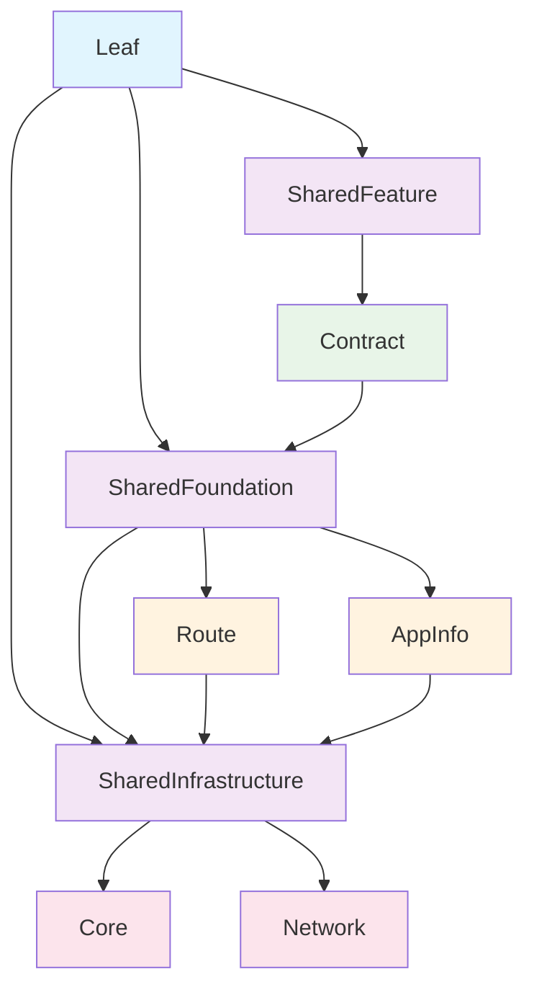

# Borderless

Borderless는 명확한 관심사 분리와 엄격한 의존성 규칙을 구현하는 계층적 의존성 구조를 가진 모듈형 iOS 애플리케이션 아키텍처입니다.

## 아키텍처 개요

Borderless는 모듈이 추상화 수준에 따라 저수준에서 고수준 컴포넌트로 구성되는 계층형 아키텍처 패턴을 따릅니다. 각 레이어는 특정 책임과 엄격한 의존성 제약을 가지며, 유지보수 가능하고 확장 가능한 코드를 보장합니다.

### 핵심 원칙

#### **계층적 의존성 구조**
- 모듈은 구현 수준에 따라 구성됩니다: **저수준 → 고수준**
- 저수준 API는 고수준 API를 참조할 수 없습니다
- 고수준 API로 갈수록 추상화 단계의 차이뿐만 아니라 참조하는 범위(Scope)도 넓어집니다
- **같은 레이어 내에서의 참조를 하지 않습니다** - 순환 참조 문제를 구조적으로 방지

#### **레이어 격리**
- 순환 참조 문제를 구조적으로 방지
- 의존 그래프 가시성 확보
- interface 타겟을 생성하지 않음
- 같은 레이어 간에 공통으로 참조해야 하는 것들은 하위 레벨 모듈에서 정의

## 레이어 구조

### 🏗️ Infrastructure Layer (최저 수준)

**목적**: 앱에 따라 동작이 바뀌지 않는 것들을 정의합니다.

**구성 요소**:
- `FlexUIKit` - 크로스 앱 UI 컴포넌트
- `FXM` - 크로스 앱 UI 컴포넌트
- `AppInfoType` - 앱 정보 타입
- `Time` / `TimeRange` - 시간 관련 유틸리티
- `CodableSupport` - Codable 프로토콜 지원

**특징**:
- 플랫폼에 독립적인 구현
- 다양한 앱 변형에서 재사용 가능
- 특정 앱에 대한 의존성 없음

### 🎯 Foundation Layer

**목적**: 특정 앱에서 사용될 것을 가정하고 작성하는 공통 컴포넌트입니다.

**구성 요소**:
- `LeafCommon` - Leaf 앱 공통 유틸리티
- `LeafStyle` - Leaf 앱 스타일링 시스템
- `LeafCredential` - Leaf 앱 인증
- `LeafStorage` - Leaf 앱 데이터 저장소
- `LeafRoute` - Leaf 앱 네비게이션 라우팅

**특징**:
- 특정 앱 컨텍스트에서 사용될 것을 가정
- 피처 간 공유 기능 제공
- 앱 특정 구현

### ⚡ Feature Layer

**목적**: 비즈니스 로직과 사용자 인터페이스를 구현하는 피처 특정 모듈입니다.

**구성 요소**:
- `LeafContract` - 계약 관리 피처
- `LeafTimeTracking` - 시간 추적 피처

**특징**:
- 특정 앱 사용 컨텍스트를 가정
- 외부로부터 AppInfo 주입을 받을 필요가 없음 (어떤 AppInfo를 사용할지 알고 있음)
- 특정 비즈니스 피처 구현

## 의존성 규칙

### ✅ 허용되는 의존성
- 고수준 → 저수준 (하향 의존성)
- Foundation → Infrastructure
- Feature → Foundation
- Feature → Infrastructure

### ❌ 금지되는 의존성
- 저수준 → 고수준 (상향 의존성)
- 같은 레이어 간 교차 참조
- Infrastructure → Foundation
- Infrastructure → Feature
- Foundation → Feature

## 피처 간 통신

A 피처에서 B 피처로 화면 전환이 필요할 때:

1. **직접 참조 없음**: A 피처는 B 피처를 직접 참조하지 않음
2. **Foundation 인터페이스 사용**: Foundation에 정의된 인터페이스 사용

## SharedModule

- 각 레이어에는 모듈 꾸러미를 임포트 하는 Shared 모듈이 존재한다.
- FlexFeature가 Leaf Foundation 모듈을 임포트하지 않도록 하기 위한 장치
- less `import`
    - App에서
        - import SharedFeatures
        - import SharedFoundation
        - import SharedInfrastructure
    - Feature에서
        - import SharedFoudnation
        - import SharedInfrastructure
    - Foundation에서
        - import SharedInfrastructure

## 의존성 그래프



## 프로젝트 구조

```
Borderless/
├── Infrastructure/          # 최저 수준, 앱에 독립적
│   ├── Core/
│   ├── Network/
│   └── SharedInfrastructure/
├── Leaf/                   # Leaf 앱 특정
│   ├── App/
│   ├── Feature/
│   └── Foundation/
└── Flex/                   # Flex 앱 특정
│   ├── App/
    ├── Feature/
    └── Foundation/
```

## 장점

- leaf 앱 개발자는 워크 스페이스 내에서 flex 수정할 일이 없다.
- 불필요하게 노출되고 있던 과도한 정보들 차단되어 개발 생산성 올라감.
- 의존그래프 개선으로 증분 빌드 성능 개선
- 제너럴한 네이밍 가능 
    - LeafTimeTracking -> TimeTracking
    - LeafOnboardingListView -> ListView