# Borderless 의존성 분석 결과

생성 시간: Fri Aug  8 09:40:10 KST 2025

## 프로젝트 구조 분석

## Infrastructure Layer

### Core
  - Package.swift 존재

### Network
  - Package.swift 존재

### SharedInfrastructure
  - Package.swift 존재

## Leaf Foundation Layer

### AppInfo
  - Package.swift 존재

### Route
  - Package.swift 존재

### SharedFoundation
  - Package.swift 존재

## Leaf Feature Layer

### Contract
  - Package.swift 존재

### SharedFeature
  - Package.swift 존재

## Flex Layer

## 의존성 그래프

```mermaid
graph TD
    %% Infrastructure Layer
    Core[Core]
    Network[Network]
    SharedInfrastructure[SharedInfrastructure]

    %% Leaf Foundation Layer
    AppInfo[AppInfo]
    Route[Route]
    SharedFoundation[SharedFoundation]

    %% Leaf Feature Layer
    Contract[Contract]
    SharedFeature[SharedFeature]

    %% Dependencies

    style Core fill:#e1f5fe
    style Network fill:#e1f5fe
    style SharedInfrastructure fill:#e1f5fe
    style AppInfo fill:#f3e5f5
    style Route fill:#f3e5f5
    style SharedFoundation fill:#f3e5f5
    style Contract fill:#e8f5e8
    style SharedFeature fill:#e8f5e8
```

## 분석 요약

- Infrastructure Layer: 3 모듈
- Leaf Foundation Layer: 3 모듈
- Leaf Feature Layer: 2 모듈
